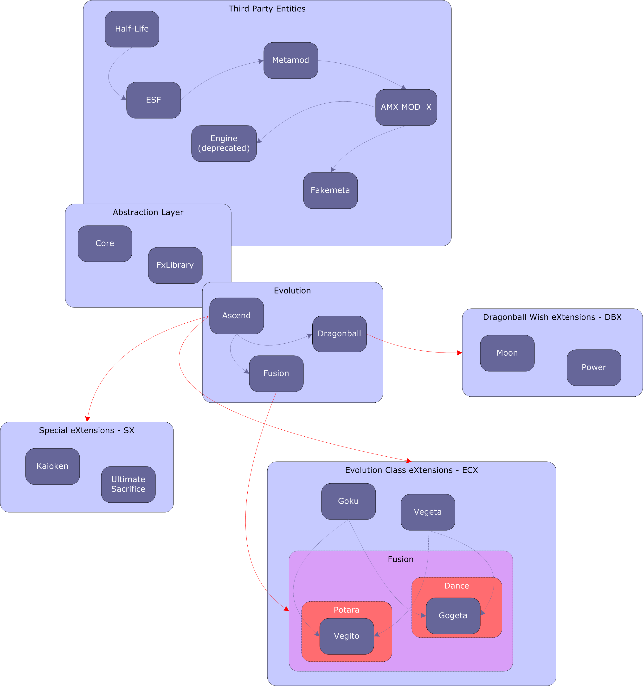

# Corona Bytes .NET Compiler Interface

A tool for creating, configuring, compiling, and managing **Evolution Class eXtensions (ECX)** for **Earth Special Forces (ESF) 1.2.3** running on **AMX Mod X**. It works together with the **Ascend** plugin.

Generates the base source files for an ECX class, lets the user edit the generated `.core` files by hand, and then compiles them into `.amxx` plugins that the server can load. The system is server-side: the server owner controls which classes are available, while clients must have the required resources installed.

The CCI Class Wizard only generates a `.ClassExtension.core` file.

The CCI includes the AMX Mod X compiler. To compile, select the class on the left side of the CCI and click the green arrow. If the game installation is correctly registered, the CCI can automatically place the compiled `.amxx` file into the `core/plugins/CX` folder of the ESF installation. The `CORE.Manager` plugin loads all `.amxx` files in that folder automatically. Additional folders and debug flags can be set in `/core/manager.ini`



### NOTES

Later, the CCI project was modified by an ESFKAMI member and these details had been inserted in the code to see in the forum posts:

- addFusion:
http://dev.esfkami.net/forum_posts.asp?TID=80

- MOD.Weapon.core:
http://dev.esfkami.net/forum_posts.asp?TID=49&PID=60

These references have been replaced by CCI documents, because the site is down.

They put their logo in `Resources/` to change wizard picture.
In _ClassWizard.cs_, that was their code after `this.console.Clear();` in `LoadPlugins` method:
```cs
            this.console.Text = "������������������������������\nESFKAMI\nwww.esfkami.net\n\nESFKAMI Community\nforum.esfkami.net | foro.esfkami.net\n������������������������������";
```
and that was in `gpl` variable, they put their development community site to continue with ECX, nowadays is down:
```cs
        private readonly string gpl = "/*" + Environment.NewLine + "** << Evolution Class Extension >>" + Environment.NewLine + "**" + Environment.NewLine + "** \tCopyright (C) 2005 - 2007 Corona Bytes .NET" + Environment.NewLine + "**" + Environment.NewLine + "** This program is free software; you can redistribute it and/or" + Environment.NewLine + "** modify it under the terms of the GNU General Public License" + Environment.NewLine + "** as published by the Free Software Foundation; either version 2" + Environment.NewLine + "** of the License, or (at your option) any later version." + Environment.NewLine + "**" + Environment.NewLine + "** This program is distributed in the hope that it will be useful," + Environment.NewLine + "** but WITHOUT ANY WARRANTY; without even the implied warranty of" + Environment.NewLine + "** MERCHANTABILITY or FITNESS FOR A PARTICULAR PURPOSE.  See the" + Environment.NewLine + "** GNU General Public License for more details." + Environment.NewLine + "**" + Environment.NewLine + "** You should have received a copy of the GNU General Public License" + Environment.NewLine + "** along with this program; if not, write to the Free Software" + Environment.NewLine + "** Foundation, Inc., 51 Franklin Street, Fifth Floor, Boston, MA  02110-1301, USA." + Environment.NewLine + "**" + Environment.NewLine + "**" + Environment.NewLine + "**\tESFKAMI www.esfkami.net" + Environment.NewLine + "**" + Environment.NewLine + "** ESFKAMI is a professional ESF development and sharing community," + Environment.NewLine + "** You can get professional ESF Development Knowledge Without registering or logging in," + Environment.NewLine + "** Every project of ours is absolutely OpenSource." + Environment.NewLine + "*/" + Environment.NewLine + Environment.NewLine;
```

## Legal

CCI project source code (such as `CCI/`, `CCI.Properties/`, `Properties/`, `CCI.sln` and `CCI.csproj`) is [GPLv2 licensed](GPL.txt).<br/>
The rest of tools are used for testing purposes.

## Credits

Project Leader:
- Raven

Coder:
- Lord-of-Destruction
- Raven
- Greenberet

Modeler:
- Raven
- Dj-Ready
- Super Vegetto
- Kreshi
- DBZHell
- Lord Killmore
- Tryforce
- God Gundam
- Kama
- Eclipse
- Raven Blade
- MSF
- Kenny-DK
- Mr. Smo
- Bushidou
- Davidskiwan
- Mad Axeman
- Chireru
- Darkone
- NED
- Stephen
- Adam
- Enix
- Diodilla
- DOR

Spriter:
- Raven
- Ice-X
- Lord-of-Destruction
- DBZGoKuSSJ4
- Skizer

Sounds:
- Raven
- Stephen

Maps:
- Dj-Ready
- Kong Kong
- Donnierisk
- ESF-Team

Helper:
- JinX
- MSF
- Grega
- Skizer
- Skyrider

Tiny and personal CCI modifications:
- Someone from ESFKAMI
